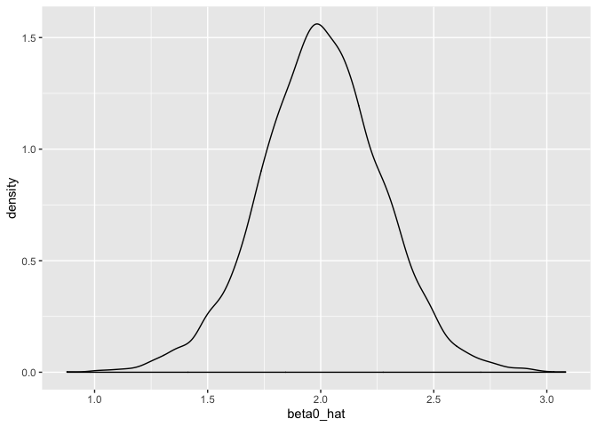
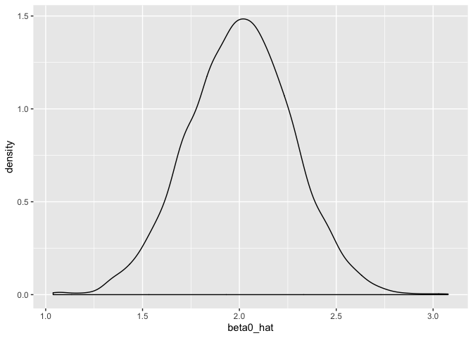
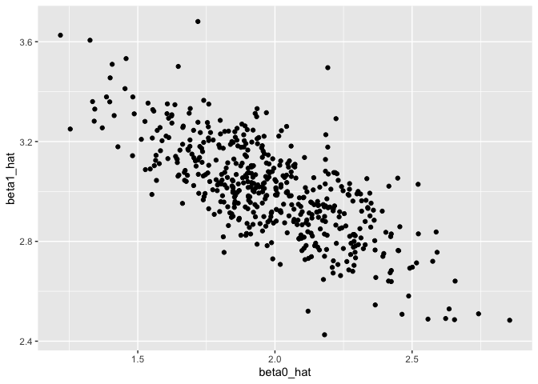
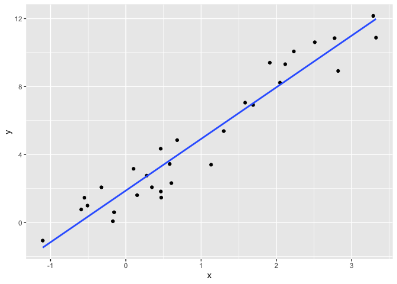
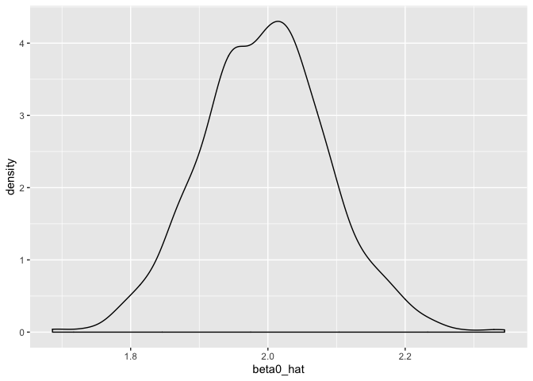

simulation
================
AimingLiu
10/31/2019

``` r
library(tidyverse)
```

    ## ── Attaching packages ────────────────────────────────── tidyverse 1.2.1 ──

    ## ✔ ggplot2 3.2.1     ✔ purrr   0.3.3
    ## ✔ tibble  2.1.3     ✔ dplyr   0.8.3
    ## ✔ tidyr   1.0.0     ✔ stringr 1.4.0
    ## ✔ readr   1.3.1     ✔ forcats 0.4.0

    ## ── Conflicts ───────────────────────────────────── tidyverse_conflicts() ──
    ## ✖ dplyr::filter() masks stats::filter()
    ## ✖ dplyr::lag()    masks stats::lag()

``` r
set.seed(1)
sim_regression = function(n, beta0 = 2, beta1 = 3) {
  
  sim_data = tibble(
    x = rnorm(n, mean = 1, sd = 1),
    y = beta0 + beta1 * x + rnorm(n, 0, 1)
  )
  
  ls_fit = lm(y ~ x, data = sim_data)
  
  tibble(
    beta0_hat = coef(ls_fit)[1],
    beta1_hat = coef(ls_fit)[2]
  )
}
```

``` r
sim_regression(n = 30)
```

    ## # A tibble: 1 x 2
    ##   beta0_hat beta1_hat
    ##       <dbl>     <dbl>
    ## 1      2.09      3.04

## rerun simulation using for loop

``` r
output = vector("list",length = 5000)

for(i in 1:5000){
  output[[i]] = sim_regression(n = 30)
}
bind_rows(output) %>% 
  ggplot(aes(x = beta0_hat))+
    geom_density()
```

<!-- -->

## rerun simulation using purrr

``` r
output = rerun(5000,sim_regression(n = 30)) # rerun is a function
 bind_rows(output) %>% 
  ggplot(aes(x = beta0_hat))+
    geom_density()
```

<!-- -->

## compared the two methods,look almost the same for repeat 5000 times

``` r
sim_results = 
  rerun(500, sim_regression(30, 2, 3)) %>% 
  bind_rows()
 
 sim_results %>% 
   ggplot(aes(x = beta0_hat,y = beta1_hat))+
    geom_point()
```

<!-- -->

``` r
sim_data = tibble(
  x = rnorm(30,mean = 1,sd = 1),
  y = 2+3*x+rnorm(30,0,1)
)

sim_data %>% 
  ggplot(aes(x = x,y = y))+
  geom_point()+
  stat_smooth(method = "lm",se = FALSE)
```

<!-- -->

``` r
sim_results %>% 
  gather(key = parameter, value = estimate, beta0_hat:beta1_hat) %>% 
  group_by(parameter) %>% 
  summarize(emp_mean = mean(estimate),
            emp_var = var(estimate)) %>% 
  knitr::kable(digits = 3)
```

| parameter  | emp\_mean | emp\_var |
| :--------- | --------: | -------: |
| beta0\_hat |     1.982 |    0.071 |
| beta1\_hat |     3.007 |    0.037 |

### try another sample size

``` r
n_list = list("n_30"  = 30, 
              "n_60"  = 60, 
              "n_120" = 120, 
              "n_240" = 240)

output = vector("list", length = 4)# run for each sample size

for (i in 1:4){
  output[[i]] = rerun(1000,sim_regression(n = n_list[[i]])) %>% 
  bind_rows
}

output[[4]] %>% 
  ggplot(aes(x = beta0_hat))+geom_density()
```

<!-- -->

``` r
sim_results = 
  tibble(
  sample_size = c(30,60,120,240)
) %>% 
  mutate(
    output_list = map(.x = sample_size,~rerun(1000,sim_regression(n = .x))),output_df = map(output_list,bind_rows)) %>% 
  select(-output_list) %>% 
  unnest(output_df)
```

``` r
sim_results %>% 
  group_by(sample_size) %>% 
  summarize(var_b1 = var(beta1_hat))
```

    ## # A tibble: 4 x 2
    ##   sample_size  var_b1
    ##         <dbl>   <dbl>
    ## 1          30 0.0346 
    ## 2          60 0.0187 
    ## 3         120 0.00859
    ## 4         240 0.00421
